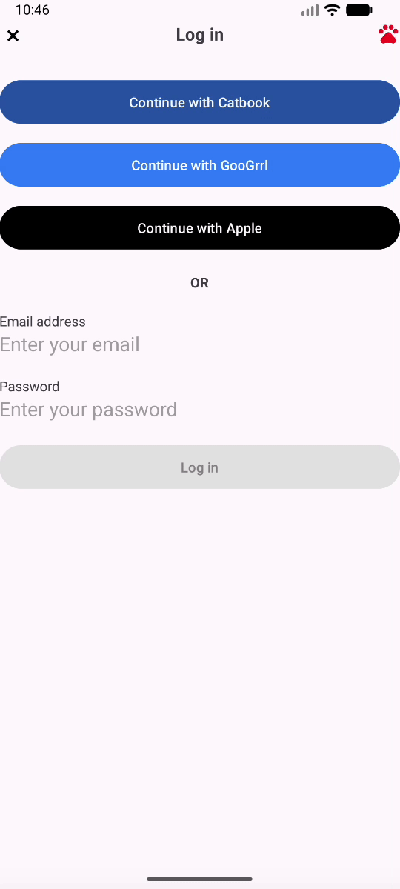

# AND101 Project 3 - AnimalApps

Submitted by: **Azaera Toussaint**

Time spent: **5** hours spent in total

## Summary

**Purrrtnrist** is an Android app that recreates a login screen layout inspired by a real application but redesigned with a fun animal theme. The app includes animal-themed login options such as Catbook and GooGrrl and demonstrates how to build Android layouts using ConstraintLayout, ImageView, and TextView components.

If I had to describe this project in three (3) emojis, they would be: 🐾📱🎨

## Application Features

The following REQUIRED features are completed:

- [x] Pick an app screenshot to duplicate  
- [x] Create a runnable app that displays an Animal Version of your chosen screenshot  
- [x] Layout uses one (1) or more ConstraintLayout  
- [x] Layout uses one (1) or more ImageView  
- [x] Layout uses three (3) or more TextViews  

The following STRETCH features are implemented:

- [x] Create a custom-shape Button using Shape Drawables
- [x] Customize the text fonts by creating new Font Resources
- [x] Add Tooltips to your Views to help users understand how to navigate the UI
- [x] Create a second layout, this time for an original, personal app idea

The following EXTRA features are implemented:

- [ ] Additional UI styling for improved layout appearance

## Chosen Screenshot

I have chosen to duplicate the following layout from the **Pinterest Login Screen** app:

## Video Demo

Here's a video / GIF that demos all of the app's implemented features:

GIF created with **Kap**

## Original App Layout (Optional Stretch Feature)

Not implemented.

## Notes

One challenge during this project was learning how to correctly position elements using ConstraintLayout constraints. This helped me better understand how Android layouts work and how UI components are arranged using XML.

## License

Copyright **2026** **Azaera Toussaint**

Licensed under the Apache License, Version 2.0 (the "License");
you may not use this file except in compliance with the License.

http://www.apache.org/licenses/LICENSE-2.0
